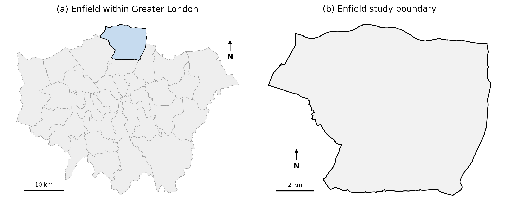
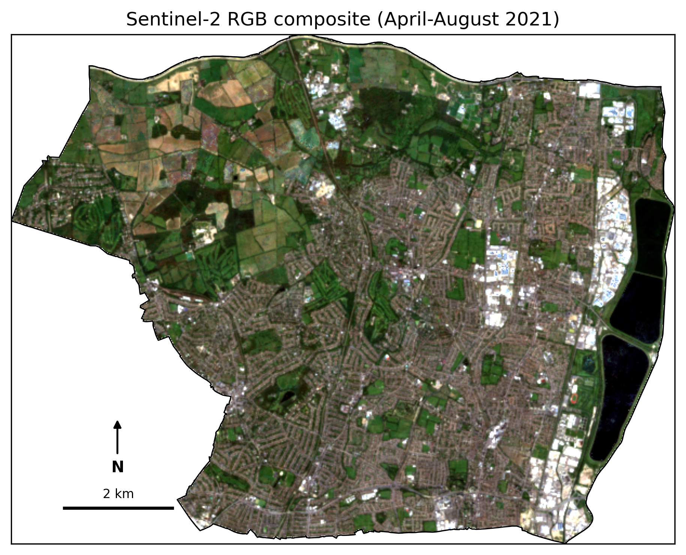
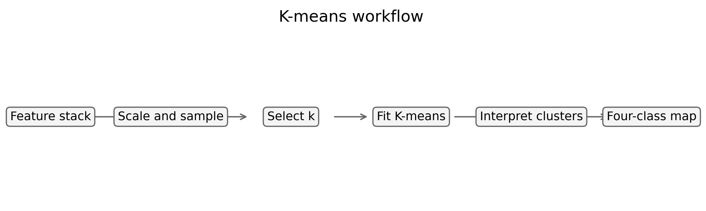
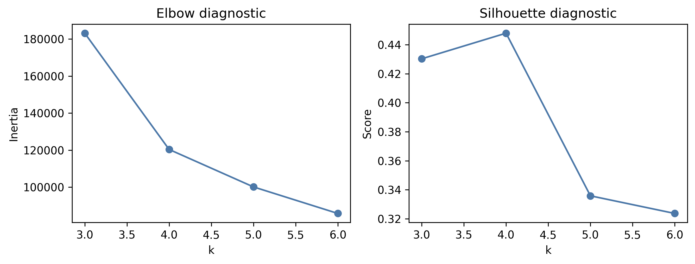
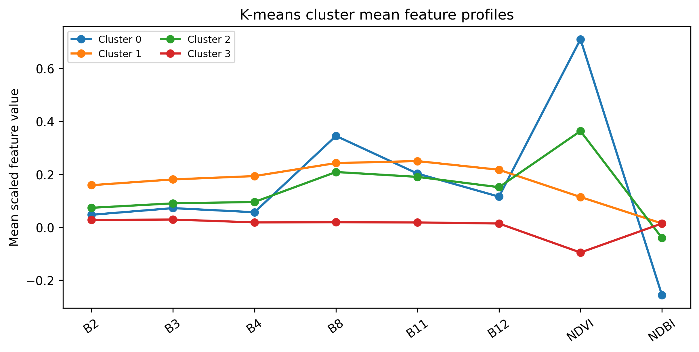
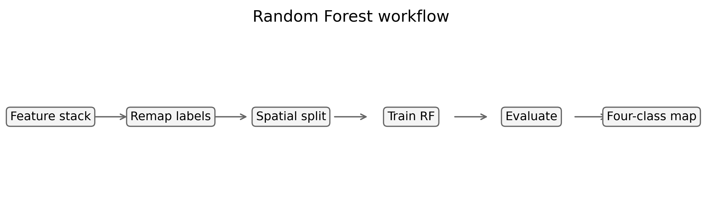
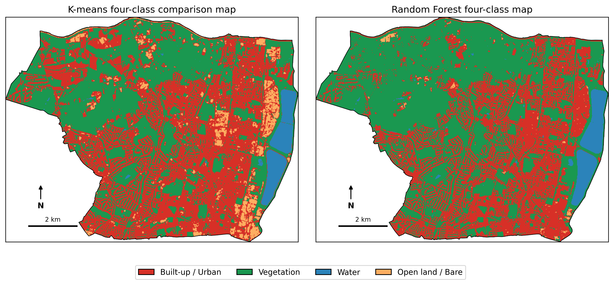
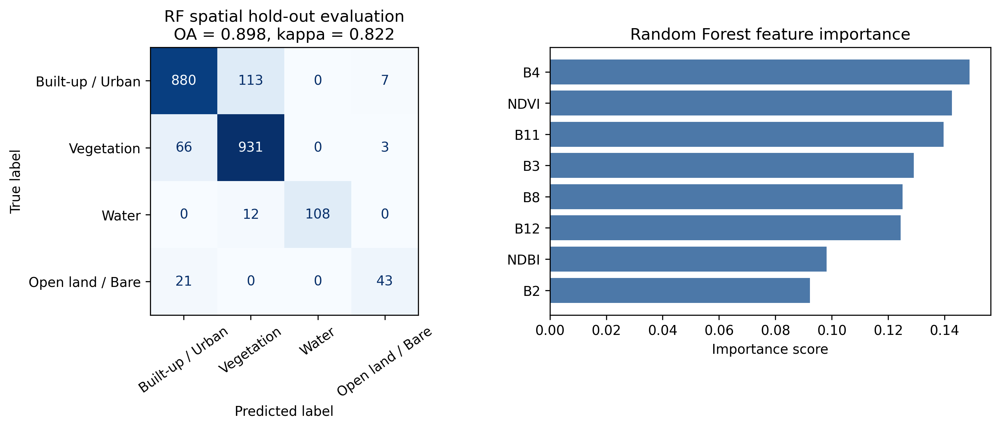
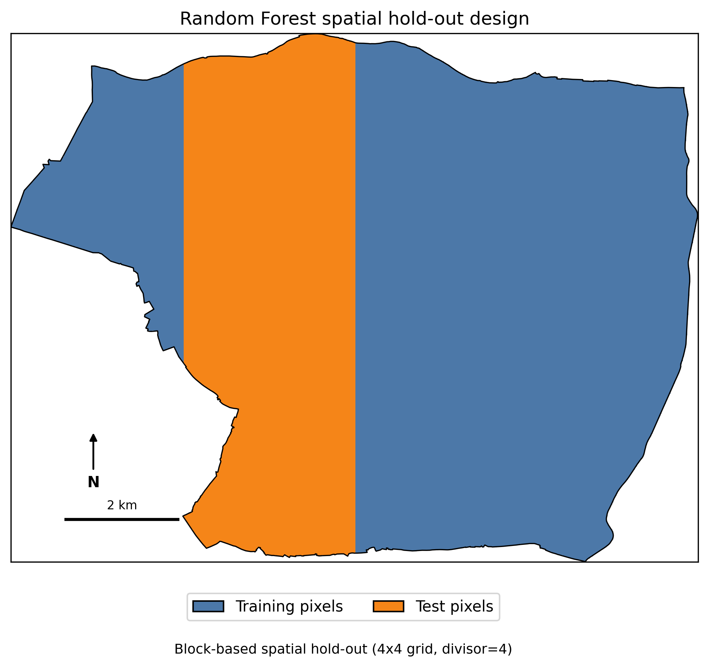
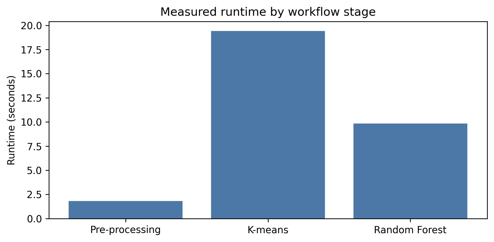

# Evaluating Supervised and Unsupervised Land-Cover Classification in Urban Environments

## A Sentinel-2 Case Study of Enfield, London

This repository presents a GEOL0069 land-cover classification project comparing **K-means clustering** and **Random Forest classification** in the London Borough of Enfield. The analysis uses a **2021 April-August Sentinel-2 Level-2A seasonal composite**, Sentinel-2 cloud probability masking, and a remapped ESA WorldCover 2021 reference layer.

The project is a **single-year classification comparison**, not a multi-year change detection study. Both methods use the same Sentinel-2 feature stack, so differences in the outputs can be interpreted as differences in modelling approach rather than differences in input imagery.

## Research Question

**How do supervised and unsupervised methods differ in their representation of borough-scale urban land cover in Enfield, and what does this reveal about interpretability, reference-label agreement, and computational cost?**

The comparison uses four target classes:

- Built-up / Urban
- Vegetation
- Water
- Open land / Bare or sparsely vegetated surfaces

## Project Motivation

Urban land-cover classification is difficult because built surfaces, vegetation, water, bare ground, and open land often occur close together and can overlap spectrally within Sentinel-2 pixels. This is especially relevant in Enfield, where residential areas, parks, reservoirs, transport corridors, agricultural margins, and sparsely vegetated surfaces coexist within a compact borough-scale study area.

The value of using Enfield is not simply that it contains diverse land-cover types. The important point is that this diversity creates a classification problem: class boundaries are spatially mixed, reference labels are imperfect, and different algorithms may respond differently to ambiguous urban surfaces. This makes Enfield a useful case study for evaluating the trade-off between unsupervised spectral structure and supervised semantic consistency.

## Study Area

The study area is the **London Borough of Enfield**, defined using an official London borough boundary layer. The borough covers approximately **8,220 ha** and contains dense urban fabric, suburban residential areas, parks, reservoirs, river corridors, transport infrastructure, agricultural edges, and open or sparsely vegetated surfaces.

At Sentinel-2 resolution, residential pixels may contain buildings, roads, gardens, street trees, and small green spaces. Similarly, open land and bare surfaces may overlap spectrally with dry grass, concrete, bright roofs, car parks, and rail corridors. This spatial and spectral mixture makes the borough suitable for comparing how K-means and Random Forest handle urban classification ambiguity.



## Data Source and Pre-processing

The workflow combines the Enfield boundary, Sentinel-2 Level-2A surface reflectance, Sentinel-2 cloud probability, and ESA WorldCover 2021 labels to produce an 8-feature Sentinel-2 array and a four-class reference label array for modelling.

The analysis uses **April-August 2021** imagery. This leaf-on period was selected because vegetation is more spectrally distinct from built-up and bare surfaces, while avoiding unnecessary seasonal variation from winter conditions. A broad scene-level cloud filter (`CLOUDY_PIXEL_PERCENTAGE < 80`) retains enough summer observations, while pixel-level cloud masking is applied more strictly using Sentinel-2 cloud probability (`CLOUD_PROB_THRESHOLD = 40`).

A **20 m** analysis scale was selected as a practical compromise between spatial detail and Colab runtime stability. In the local GeoTIFF fallback workflow, the feature and label rasters are checked after loading to confirm that they use the same projected coordinate reference system and pixel size. The rasters are stored in **EPSG:32630 (UTM Zone 30N)**, whose map units are metres; therefore, class-area estimates treat each pixel as **20 m x 20 m** before converting totals to square kilometres.

| Item | Value |
|---|---:|
| Data source | Local GeoTIFF fallback |
| Raster CRS | EPSG:32630 |
| Raster pixel size | 20.0 m x 20.0 m |
| Feature array shape | 471 x 613 x 8 |
| Label array shape | 471 x 613 |
| Valid pixel count | 205,617 |
| Labelled pixel count | 205,617 |
| Pre-processing runtime | 0.2 seconds |

### Labelled Pixel Count

| Class | Labelled pixels |
|---|---:|
| Built-up / Urban | 78,811 |
| Vegetation | 118,713 |
| Water | 7,852 |
| Open land / Bare | 241 |



### WorldCover Remapping

| WorldCover class | Target class |
|---|---|
| Tree cover, shrubland, grassland, cropland, herbaceous wetland | Vegetation |
| Built-up | Built-up / Urban |
| Permanent water bodies | Water |
| Bare / sparse vegetation, moss and lichen | Open land / Bare |
| Snow and ice, mangroves | Ignored |

## Method Overview

Both classification methods use the same 2021 Sentinel-2 feature stack. The comparison therefore isolates the effect of the modelling approach: K-means is used as an unsupervised spectral baseline, while Random Forest is used as a supervised label-driven classifier trained with the remapped WorldCover reference raster.

The feature stack contains six Sentinel-2 spectral bands and two indices:

- B2, B3, B4
- B8, B11, B12
- NDVI
- NDBI

## K-means Workflow

K-means is fitted to a scaled sample of valid Sentinel-2 pixels. The final model uses a pre-specified `k = 4` so that the unsupervised output can be translated into the same four target classes used by the Random Forest workflow. This choice is made for comparability, not because the diagnostics prove that Enfield naturally contains exactly four spectral groups.



### K-means Diagnostics

The elbow and silhouette plots are reported to make the pre-specified `k = 4` choice transparent. The final value of `k` is not selected automatically from these diagnostics; it is fixed to match the four target land-cover classes used throughout the comparison.

| Item | Value |
|---|---:|
| K-means sample size | 50,000 pixels |
| Share of valid pixels sampled | 24.3% |
| Selected k | 4 |
| K-means runtime | 11.9 seconds |

| k | Inertia | Silhouette |
|---:|---:|---:|
| 3 | 183,772.000 | 0.431 |
| 4 | 120,867.148 | 0.452 |
| 5 | 100,350.695 | 0.338 |
| 6 | 86,279.258 | 0.327 |



### Heuristic Cluster Interpretation

The K-means clusters are interpreted using cluster feature profiles and map inspection. These labels should be read as heuristic comparison labels rather than field-validated land-cover classes. In particular, the Built-up / Urban cluster represents mixed urban fabric at 20 m resolution rather than pure impervious surface.

| Cluster | Pixel count | Pixel percent (%) | Mean NDVI | Mean NDBI | Suggested class | Interpretation |
|---:|---:|---:|---:|---:|---|---|
| 0 | 7,769 | 3.778 | -0.096 | 0.015 | Water | Lowest NDVI and lowest NIR response, consistent with water bodies. |
| 1 | 89,536 | 43.545 | 0.709 | -0.256 | Vegetation | Highest NDVI and NIR response, consistent with vegetated surfaces. |
| 2 | 97,778 | 47.553 | 0.362 | -0.039 | Built-up / Urban | Moderate NDVI suggests mixed residential urban pixels rather than pure built-up surface. |
| 3 | 10,534 | 5.123 | 0.113 | 0.015 | Open land / Bare | Low vegetation signal with stronger SWIR response, consistent with open or sparsely vegetated surfaces. |



## Random Forest Workflow

Random Forest uses the same Sentinel-2 feature stack together with the remapped WorldCover reference raster. It is trained and evaluated with a block-based spatial hold-out split before being applied to all valid Enfield pixels.



The supervised workflow provides clearer semantic class labels than K-means, but the evaluation should be interpreted as agreement with the WorldCover-derived reference layer rather than independent field-validated accuracy.

### Random Forest Sampling Summary

| Class | Train available | Train sampled | Test available | Test sampled |
|---|---:|---:|---:|---:|
| Built-up / Urban | 60,068 | 2,500 | 18,743 | 1,000 |
| Vegetation | 72,866 | 2,500 | 45,847 | 1,000 |
| Water | 7,732 | 2,500 | 120 | 120 |
| Open land / Bare | 177 | 177 | 64 | 64 |

## Results and Comparison

The final maps show the common four-class scheme produced by the unsupervised and supervised workflows. K-means produces a more fragmented map because it responds directly to spectral structure. Random Forest produces a cleaner thematic map because it is constrained by the reference-label scheme.



### Random Forest Evaluation

The Random Forest model achieved an overall agreement of **0.898** and a Cohen's kappa of **0.822** against the remapped WorldCover-derived labels under the block-based spatial hold-out design. These values indicate strong reference-label agreement, but they should not be interpreted as independent field-validated accuracy.

| Metric | Value |
|---|---:|
| Split method | Block-based spatial hold-out, 4x4 grid, divisor=4 |
| Overall agreement | 0.898 |
| Cohen's kappa | 0.822 |
| Random Forest runtime | 7.9 seconds |

| Class | Precision | Recall | F1-score | Support |
|---|---:|---:|---:|---:|
| Built-up / Urban | 0.910 | 0.880 | 0.895 | 1,000 |
| Vegetation | 0.882 | 0.931 | 0.906 | 1,000 |
| Water | 1.000 | 0.900 | 0.947 | 120 |
| Open land / Bare | 0.811 | 0.672 | 0.735 | 64 |
| Macro avg | 0.901 | 0.846 | 0.871 | 2,184 |
| Weighted avg | 0.899 | 0.898 | 0.898 | 2,184 |

The confusion matrix and feature-importance panel show that Vegetation and Water are more reliably identified, while Open land / Bare is weaker because it has fewer reference samples and overlaps spectrally with several urban materials.



### Spatial Hold-out Design

The spatial hold-out split is shown explicitly to make the evaluation design visible. This is more transparent and more conservative than a purely random pixel split, which could overestimate performance because neighbouring pixels often share similar spectral and land-cover properties.



### Class Area Comparison

Values are from the submitted reproducible run using `RANDOM_STATE = 42`.

| Class | K-means (%) | Random Forest (%) | Difference, RF - K-means (pp) | Interpretation |
|---|---:|---:|---:|---|
| Built-up / Urban | 47.55 | 39.20 | -8.36 | RF maps less built-up land, reflecting closer alignment with the WorldCover reference-label scheme. |
| Vegetation | 43.55 | 56.24 | +12.69 | RF maps more vegetation, likely influenced by gardens, parks, and mixed urban-green pixels. This is the largest method difference in the table. |
| Water | 3.78 | 4.04 | +0.26 | Very similar between methods, consistent with strong water separability. |
| Open land / Bare | 5.12 | 0.53 | -4.60 | K-means allocates more area to spectrally bright or low-vegetation surfaces, while RF maps much of this into other reference classes. |

## Discussion and Limitations

### Where K-means Adds Value

K-means adds value by exposing spectral structure that is compressed once the analysis is translated into a fixed four-class land-cover scheme. In this project, `k = 4` is used to match the shared comparison framework rather than to claim that Enfield naturally contains only four spectral groups.

The cluster profile plot and post-hoc interpretation table show that Enfield contains clearly vegetated and water-dominated surfaces, as well as more ambiguous combinations of built materials, sparse vegetation, and open ground. The Built-up / Urban cluster should be read carefully: its moderate NDVI indicates mixed urban fabric rather than pure impervious surface, which is plausible at 20 m resolution because residential pixels often contain buildings, roads, gardens, street trees, and small green spaces.

K-means is therefore useful for spectral interpretation, but weaker as a final labelled land-cover map because its class names depend on post-hoc interpretation.

### Where Random Forest Is More Reliable

Random Forest produces the more submission-ready four-class land-cover map because it is tied to named classes and evaluated against the remapped WorldCover reference layer. Its strength is semantic clarity and consistency. However, the model is best understood as reproducing a reference classification scheme rather than independently verifying the true land cover of Enfield.

### Ambiguous Surfaces in Enfield

The largest differences between methods occur in the balance between Built-up / Urban, Vegetation, and Open land / Bare. Car parks, dry grass, bare soil, rail corridors, bright roofs, paved surfaces, and sparsely vegetated ground can overlap spectrally at 20 m resolution. By contrast, large reservoirs and dense vegetation are more distinct, which helps explain why Water and Vegetation are more stable across the two methods.

The Open land / Bare class should be interpreted most cautiously. It has far fewer available samples than Built-up / Urban and Vegetation, and class weighting cannot fully compensate for limited and spectrally mixed reference samples. Its weaker F1-score is therefore likely caused by both class imbalance and genuine spectral overlap.

### Implications for Borough-scale AI4EO Workflows

The results show a trade-off between spectral flexibility and semantic consistency. K-means is useful for revealing internal variation and mixed urban surfaces, but it depends on post-hoc interpretation. Random Forest is more effective when the goal is a clearly labelled borough-scale product, but it is constrained by the quality, balance, and definitions of the reference labels used for training.

Overall, the Enfield case study shows that the two methods answer different classification questions. Random Forest is better suited to producing a stable labelled land-cover product when a reference scheme is available, while K-means is more useful for exposing spectral ambiguity in mixed urban environments. The strongest interpretation therefore comes from reading the two outputs together rather than treating one method as a direct replacement for the other.

## Environmental Cost

The computational footprint of the workflow is estimated from measured stage runtimes. The estimate reflects the executed Colab run with local fallback inputs and does not include the upstream cost of generating the GeoTIFF data package.

The workflow has a very small measured footprint because it uses CPU-only classical machine learning, a borough-scale area of interest, and a 20 m working resolution.

| Stage | Runtime (hours) | Energy (kWh) | CO2e (g) | Estimated cost (£) |
|---|---:|---:|---:|---:|
| Pre-processing | 0.00005 | 0.00000 | 0.00045 | 0.00000 |
| K-means | 0.00332 | 0.00012 | 0.02704 | 0.00003 |
| Random Forest | 0.00220 | 0.00008 | 0.01793 | 0.00002 |
| Total | 0.00557 | 0.00019 | 0.04542 | 0.00005 |



## Repository Structure

```text
GEOL0069-23004877-Enfield-LandCover-Classification/
|-- Enfield_LandCover_KMeans_RF_GEOL0069.ipynb
|-- README.md
|-- requirements.txt
|-- data/
|   |-- enfield_boundary_gla.geojson
|   |-- enfield_s2_features_2021_20m.tif
|   |-- enfield_worldcover4_2021_20m.tif
|-- figures/
|   |-- study_area.png
|   |-- sentinel2_rgb.png
|   |-- kmeans_workflow.png
|   |-- kmeans_diagnostics.png
|   |-- kmeans_cluster_profiles.png
|   |-- rf_workflow.png
|   |-- final_classification_maps.png
|   |-- rf_evaluation.png
|   |-- spatial_holdout.png
|   |-- environmental_cost.png
```

## Reproducibility

The notebook can be opened in Google Colab or Jupyter and run from top to bottom. If Earth Engine authentication is unavailable, keep `USE_EE = False` and use the local GeoTIFF fallback files in the `data/` folder.

Install dependencies with:

```bash
pip install -r requirements.txt
```

## References

Breiman, L. (2001) 'Random forests', *Machine Learning*, 45, pp. 5-32. https://doi.org/10.1023/A:1010933404324

ESA WorldCover Consortium (2021) *ESA WorldCover 10 m 2021 v200*. Available at: https://esa-worldcover.org/en (Accessed: 14 May 2026).

Google Earth Engine Data Catalog (n.d.) *Harmonized Sentinel-2 MSI: MultiSpectral Instrument, Level-2A (SR)*, `COPERNICUS/S2_SR_HARMONIZED`. Available at: https://developers.google.com/earth-engine/datasets/catalog/COPERNICUS_S2_SR_HARMONIZED (Accessed: 14 May 2026).

Google Earth Engine Data Catalog (n.d.) *Sentinel-2: Cloud Probability*, `COPERNICUS/S2_CLOUD_PROBABILITY`. Available at: https://developers.google.com/earth-engine/datasets/catalog/COPERNICUS_S2_CLOUD_PROBABILITY (Accessed: 14 May 2026).

Google Earth Engine Data Catalog (n.d.) *ESA WorldCover 10m v200*, `ESA/WorldCover/v200`. Available at: https://developers.google.com/earth-engine/datasets/catalog/ESA_WorldCover_v200 (Accessed: 14 May 2026).

Gorelick, N., Hancher, M., Dixon, M., Ilyushchenko, S., Thau, D. and Moore, R. (2017) 'Google Earth Engine: Planetary-scale geospatial analysis for everyone', *Remote Sensing of Environment*, 202, pp. 18-27. https://doi.org/10.1016/j.rse.2017.06.031

Greater London Authority (n.d.) *London Boroughs*. Available at: https://data.london.gov.uk/dataset/london_boroughs (Accessed: 14 May 2026).

MacQueen, J. (1967) 'Some methods for classification and analysis of multivariate observations', in Le Cam, L. M. and Neyman, J. (eds.) *Proceedings of the Fifth Berkeley Symposium on Mathematical Statistics and Probability, Volume 1: Statistics*. Berkeley, CA: University of California Press, pp. 281-297.

Pedregosa, F. et al. (2011) 'Scikit-learn: Machine Learning in Python', *Journal of Machine Learning Research*, 12, pp. 2825-2830. Available at: https://jmlr.org/papers/v12/pedregosa11a.html (Accessed: 14 May 2026).

Rouse, J. W., Haas, R. H., Schell, J. A. and Deering, D. W. (1974) 'Monitoring vegetation systems in the Great Plains with ERTS', in *Proceedings of the Third Earth Resources Technology Satellite-1 Symposium*. NASA SP-351, Vol. 1, pp. 309-317.

Zha, Y., Gao, J. and Ni, S. (2003) 'Use of normalized difference built-up index in automatically mapping urban areas from TM imagery', *International Journal of Remote Sensing*, 24(3), pp. 583-594. https://doi.org/10.1080/01431160304987